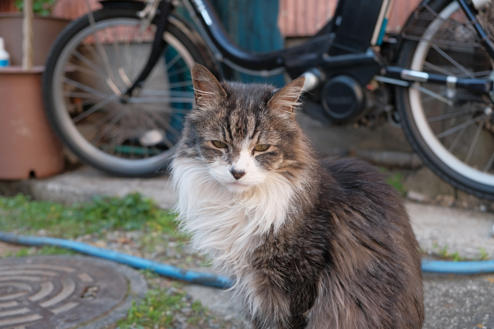

ここの文章が一覧に表示されるっぽい

<!--more-->
<!-- more の間にスペースあったらだめっぽい -->
## Headings

マークダウン記法のテスト

# H1
## H2
### H3
#### H4
##### H5
###### H6

## Paragraph

吾輩は猫である。名前はまだない。

　どこで生れたか頓（とん）と見当がつかぬ。何でも薄暗いじめじめした所でニャーニャー泣いていた事だけは記憶している。吾輩はここで始めて人間というものを見た。しかもあとで聞くとそれは書生という人間中で一番獰悪（どうあく）な種族であったそうだ。この書生というのは時々我々を捕（つかま）えて煮て食うという話である。しかしその当時は何という考（かんがえ）もなかったから別段恐しいとも思わなかった。ただ彼の掌（てのひら）に載せられてスーと持ち上げられた時何だかフワフワした感じがあったばかりである。  
掌の上で少し落ち付いて書生の顔を見たのがいわゆる人間というものの見始（みはじめ）であろう。この時妙なものだと思った感じが今でも残っている。第一毛を以て装飾されべきはずの顔がつるつるしてまるで薬缶（やかん）だ。その後猫にも大分逢（あ）ったがこんな片輪には一度も出会（でく）わした事がない。のみならず顔の真中が余りに突起している。

そうしてその穴の中から時々ぷうぷうと烟（けむり）を吹く。どうも咽（む）せぽくて実に弱った。これが人間の飲む烟草（タバコ）というものである事は漸（ようや）くこの頃（ごろ）知った。

## Blockquotes

引用されたコンテンツを表します。`footer` や `cite`で引用、および中訳をつけることができ、文末に出典が記載される。

#### Blockquote without attribution

> Tiam, ad mint andaepu dandae nostion secatur sequo quae.
> **Note** that you can use *Markdown syntax* within a blockquote.

#### Blockquote with attribution

> Don't communicate by sharing memory, share memory by communicating.</p>
> — <cite>Rob Pike[^1]</cite>


[^1]: The above quote is excerpted from Rob Pike's [talk](https://www.youtube.com/watch?v=PAAkCSZUG1c) during Gopherfest, November 18, 2015.

## Tables

Tables aren't part of the core Markdown spec, but Hugo supports them out-of-the-box.

  銘柄  |  度数  |  日本酒度
--------|-------|----------
  土佐鶴 |   16  |    +4
  亀泉   |   14  |   -13
  

#### Inline Markdown within tables

| Inline&nbsp;&nbsp;&nbsp;     | Markdown&nbsp;&nbsp;&nbsp;  | In&nbsp;&nbsp;&nbsp;                | Table      |
| ---------- | --------- | ----------------- | ---------- |
| *イタリック*  | **太字**  | ~~打ち消し線~~&nbsp;&nbsp;&nbsp; | `code`     |

## Code Blocks

#### Code block with backticks

```
python

# -*- coding: utf-8 -*-
 
a="Hello"
b="world"
 
#文字の連結
c=a+b
print( "%s+%s=%s" % ( a,b,c ) )
 
#文字列の繰り返し
f=a*10 print( f )
 
#フォーマット文字列で整形
d=format( '%s %s' % (a,b) )
print( d )
 
#置換
g=b.replace('or','OR')
print( g )
 
#文字列両端のスペース、タブ文字、改行を削除
h=' hello \n\n\n'
print( h )
i=h.strip()
print( i )

```

#### Code block with Hugo's internal highlight shortcode

# -*- coding: utf-8 -*-
 
a="Hello"
b="world"
 
#文字の連結
c=a+b
print( "%s+%s=%s" % ( a,b,c ) )
 
#文字列の繰り返し
f=a*10 print( f )
 
#フォーマット文字列で整形
d=format( '%s %s' % (a,b) )
print( d )
 
#置換
g=b.replace('or','OR')
print( g )
 
#文字列両端のスペース、タブ文字、改行を削除
h=' hello \n\n\n'
print( h )
i=h.strip()
print( i )


## List Types

#### Ordered List

1. まず～
2. 次に～
3. 最後に～

#### Unordered List

* hoge
* huga
* hogehoge

#### Nested list

* Item
  1. First Sub-item
  2. Second Sub-item

## Link and Picture

### Link

[ラズパイで部屋の見える化してみる、その1](https://qiita.com/ringo156/items/43f12e1582381f081231)

別タブで開く場合  
<a href="https://qiita.com/ringo156/items/a6affeca55477fa19c00" target="_blank">ラズパイで部屋の見える化してみる、その2</a>	

### Picture




## Other Elements — abbr, sub, sup, kbd, mark, color

<abbr title="Graphics Interchange Format">GIF</abbr> is a bitmap image format.

H<sub>2</sub>O

X<sup>n</sup> + Y<sup>n</sup> = Z<sup>n</sup>

Press <kbd><kbd>CTRL</kbd>+<kbd>ALT</kbd>+<kbd>Delete</kbd></kbd> to end the session.

<span style="color: red; ">red</span> and <span style="color: yellow; ">yellow</span>

